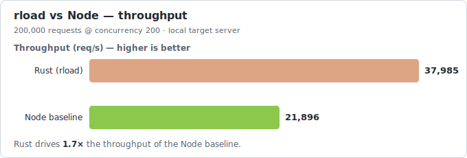
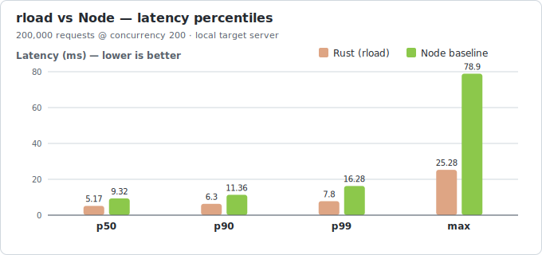

# rload

A small, fast HTTP load testing CLI written in Rust.

`rload` fires concurrent HTTP requests at a URL and reports throughput, latency
percentiles (p50/p90/p99), and a status-code breakdown. It's a focused
alternative to tools like `hey` / `wrk`, built to demonstrate how much
per-request overhead the runtime adds under load.

This repo also ships an idiomatic **Node.js reference implementation** and a
reproducible benchmark harness, so the performance claims below can be verified
on your own machine.

## Why this exists

Load generators live or die by their own overhead: the less CPU the tool spends
per request, the more load it can drive from one box and the cleaner its latency
measurements are. Rust's zero-cost async (Tokio) and lack of a garbage collector
make it a natural fit. The benchmark below puts a number on that.

## Results

Both tools sending **200,000 requests at concurrency 200** against the same
local test server (`bench/server.js`), same machine, warm:

<p align="center">
  
  
</p>

| Metric            | Rust (`rload`) | Node (`node-load.js`) | Difference            |
| ----------------- | -------------: | --------------------: | --------------------- |
| Throughput        | **37,985 req/s** |            21,896 req/s | **1.7× higher**       |
| Mean latency      |       5.26 ms |               9.12 ms | 1.7× lower            |
| p99 latency       |    **7.80 ms** |              16.28 ms | **2.1× lower (tail)** |
| Max latency       |      25.28 ms |              78.90 ms | 3.1× lower            |

The tail-latency gap is the interesting part: with no GC pauses, `rload`'s p99
stays close to its median, while the Node baseline's tail stretches out under
sustained load.

> Numbers will vary by machine. The point isn't a fixed multiplier — it's the
> reproducible methodology. Run `bench/run-bench.ps1` (Windows) or
> `bench/run-bench.sh` (Linux/macOS) to generate your own.

## Install / build

```bash
cargo build --release
# binary at ./target/release/rload
```

## Usage

```bash
# 10,000 requests at concurrency 50 (defaults)
rload http://localhost:8080/

# 200k requests, 200 concurrent workers
rload http://localhost:8080/ -c 200 -n 200000

# Run for 30 seconds instead of a fixed count
rload http://localhost:8080/ -c 100 -d 30

# POST with a 5s timeout
rload https://api.example.com/ping -m POST -t 5
```

| Flag                | Description                                  | Default |
| ------------------- | -------------------------------------------- | ------- |
| `-c, --concurrency` | Concurrent workers (connections in flight)   | 50      |
| `-n, --requests`    | Total requests to send                       | 10000   |
| `-d, --duration`    | Run for N seconds (overrides `--requests`)   | —       |
| `-m, --method`      | HTTP method                                  | GET     |
| `-t, --timeout`     | Per-request timeout (seconds)                | 30      |

### Example output

```
--- results ---------------------------------------
requests sent : 200000
succeeded     : 200000
errors        : 0
duration      : 5.265 s
throughput    : 37985 req/s
data read     : 4.80 MB (0.91 MB/s)

latency (ms):
  min       0.05
  mean      5.26
  p50       5.17
  p90       6.30
  p99       7.80
  max      25.28

status codes:
  200 : 200000
```

## Reproducing the benchmark

The harness starts a minimal local target server, runs both load testers
against it, and prints their reports side by side.

**Windows (PowerShell):**

```powershell
.\bench\run-bench.ps1 -Concurrency 200 -Requests 200000
```

**Linux / macOS:**

```bash
./bench/run-bench.sh 200 200000
```

What's in `bench/`:

- `server.js` — a minimal Node HTTP server that replies instantly with a small
  fixed body, so the load generator is the bottleneck, not the target.
- `node-load.js` — a fair, idiomatic Node load tester (keep-alive agent, async
  worker pool) used as the baseline.
- `run-bench.ps1` / `run-bench.sh` — orchestrate the comparison.
- `gen-charts.js` — regenerates the README charts from the result numbers
  (`node bench/gen-charts.js` → `assets/*.svg`). Edit the `data` object with your
  own measurements to refresh the graphs.

### Fairness notes

- Both tools reuse connections (HTTP keep-alive / connection pooling).
- Both use an async worker-pool model with the same concurrency and request count.
- Latency is measured the same way (request start → full body read).
- The target server and load tester run on the same machine, so absolute numbers
  are conservative; the *relative* difference is what's being measured.

## How it works

`rload` spawns `--concurrency` Tokio tasks sharing a single pooled
`reqwest::Client`. Each task pulls work from an atomic counter (request-count
mode) or runs until a deadline (duration mode), recording every latency into a
per-task [HDR histogram](https://docs.rs/hdrhistogram). The histograms are merged
once at the end, giving accurate percentiles without storing every sample.

The release profile is tuned for a small, fast binary (`lto`, single codegen
unit, stripped, `panic = "abort"`).

## License

MIT — see [LICENSE](LICENSE).
